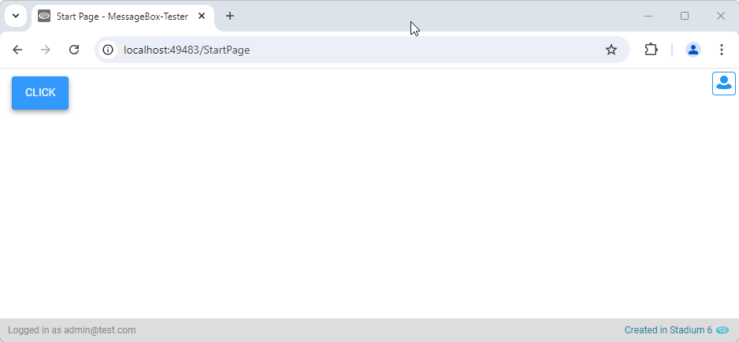

# Message Box

The built-in Stadium Message Box action supports the display of simple text and provides a set number of button pairs. Sometimes we may want to provide more options for our users. This can be achieved by creating a custom message box using a [popup](https://github.com/stadium-software/popups) or by using this module. 



# Version
Initial 1.0

# Setup

## Application Setup
1. Check the *Enable Style Sheet* checkbox in the application properties

## Global Script
1. Create a Global Script called "MessageBox"
2. Add the input parameters below to the Global Script
   1. Buttons
   2. Message
   3. Title
3. Drag a *JavaScript* action into the script
4. Add the Javascript below into the JavaScript code property
```javascript
/* Stadium Script v1.0 https://github.com/stadium-software/message-box */
let arrButtons = ~.Parameters.Input.Buttons;
let message = ~.Parameters.Input.Message;
let title = ~.Parameters.Input.Title;
let scope = this;
let returnScript = (e) => {
    scope.MessageBoxClickEventHandler(e.target.getAttribute("returnValue"));
    document.querySelector(".stadium-messagebox").remove();
};
setup();
function setup() {
    let container = document.createElement("div");
    container.classList.add("stadium-messagebox");

    let overlay = document.createElement("div");
    overlay.classList.add("overlay");

    let messageBoxTitle = document.createElement("div");
    messageBoxTitle.classList.add("message-box-header");
    messageBoxTitle.innerHTML = title;

    let messageBox = document.createElement("div");
    messageBox.classList.add("message-box");

    let contentBox = document.createElement("div");
    contentBox.classList.add("content-box");
    contentBox.innerHTML = message;

    let buttonBox = document.createElement("div");
    buttonBox.classList.add("button-box");
    for (let i = 0; i < arrButtons.length; i++) {
        let button = document.createElement("button");
        button.classList.add("btn", "btn-lg", "btn-default");
        if (arrButtons[i].classname) button.classList.add(arrButtons[i].classname);
        button.textContent = arrButtons[i].text;
        button.setAttribute("returnValue", arrButtons[i].return);
        button.addEventListener("click", returnScript, false);
        buttonBox.appendChild(button);
    }
    if (title) messageBox.appendChild(messageBoxTitle);
    messageBox.appendChild(contentBox);
    messageBox.appendChild(buttonBox);
    container.appendChild(overlay);
    container.appendChild(messageBox);
    let app = document.getElementById("app");
    app.appendChild(container);
}
```

## Type Setup
1. Add a new type called "MessageBoxButton" with the following properties
   1. text (any)
   2. return (any)
   3. classname (any)

## Page
1. Drag a *Button* control to the page
2. Add a *Click* event handler to the button

## Button.Click Event Handler
1. Drag a *List* to the script
2. Set the *List* type to "MessageBoxButton"
3. Add an entry for every button you wish to display in the popup in the order in which you want them to appear
   1. text: The text to be displayed on the button
   2. return: The value the script should return when the button is clicked
   3. classname: A class to be attached to the button for styling purposes (optional)
4. Drag the "MessageBox" script into the event handler and complete the input parameters
   1. Buttons: The *List* of buttons
   2. Message: The HTML or text you wish to display in the message box
   3. Title: A title for the MessageBox

## Custom Event Handler
When a button is clicked, the popup closes and the custom event handler script below is called. Do any processing you need to do in this script

1. Add a script under the page called "MessageBoxClickEventHandler"
2. Add the input parameters below to the script
   1. Result
3. Use a *Decision* into the "MessageBoxClickEventHandler" and use the "Result" input parameter to check which button was clicked

## CSS
The CSS below is required for the correct functioning of the module. Some elements can be [customised](#customising-css) using a variables CSS file. 

1. Create a folder called "CSS" inside of your Embedded Files in your application
2. Drag the two CSS files from this repo [*stadium-messagebox-variables.css*](stadium-messagebox-variables.css) and [*stadium-messagebox.css*](stadium-messagebox.css) into that folder
3. Paste the link tags below into the *head* property of your application
```html
<link rel="stylesheet" href="{EmbeddedFiles}/CSS/stadium-messagebox.css">
<link rel="stylesheet" href="{EmbeddedFiles}/CSS/stadium-messagebox-variables.css">
``` 

### Customising CSS
1. Open the CSS file called [*stadium-messagebox-variables.css*](stadium-messagebox-variables.css) from this repo
2. Adjust the variables in the *:root* element as you see fit
3. Overwrite the file in the CSS folder of your application with the customised file

### CSS Upgrading
To upgrade the CSS in this module, follow the [steps outlined in this repo](https://github.com/stadium-software/samples-upgrading)

## Working with Stadium Repos
Stadium Repos are not static. They change as additional features are added and bugs are fixed. Using the right method to work with Stadium Repos allows for upgrading them in a controlled manner. How to use and update application repos is described here 

[Working with Stadium Repos](https://github.com/stadium-software/samples-upgrading)