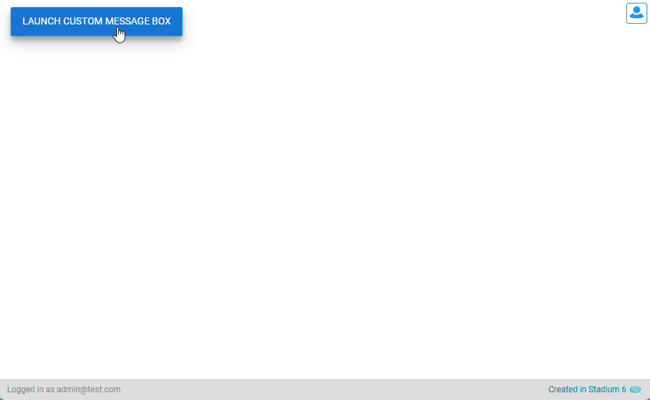
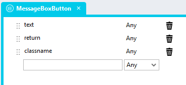
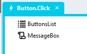
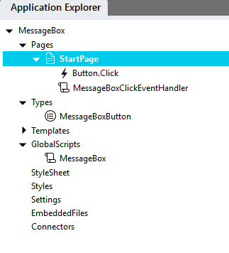

# Message Box

The built-in Stadium Message Box action supports the display of simple text and provides a set number of button pairs. Sometimes we may want to provide more options for our users. 



# Version
2.0

# Setup

## Global Script
1. Create a Global Script called "MessageBox"
2. Add the input parameters below to the Global Script
   1. Buttons
   2. Message
   3. Title
3. Drag a *JavaScript* action into the script
4. Add the Javascript below unchanged into the JavaScript code property
```javascript
/* Stadium Script v2.0 https://github.com/stadium-software/message-box */
let arrButtons = ~.Parameters.Input.Buttons;
let message = ~.Parameters.Input.Message;
let title = ~.Parameters.Input.Title;
let scope = this;
let returnScript = (e) => {
    scope.MessageBoxClickEventHandler(e.target.getAttribute("returnValue"));
    document.querySelector(".stadium-messagebox").remove();
};
setup();
function setup() {
    let fragment = document.createDocumentFragment();

    let buttonContainer = createTag("div", [], [], "");
    for (let i = 0; i < arrButtons.length; i++) {
        let button = document.createElement("button");
        button.classList.add("btn", "btn-lg", "btn-default");
        if (arrButtons[i].classname) button.classList.add(arrButtons[i].classname);
        button.textContent = arrButtons[i].text;
        button.setAttribute("returnValue", arrButtons[i].return);
        button.addEventListener("click", returnScript, false);
        buttonContainer.appendChild(button);
    }
    
    let modalContainer = createTag("div", [], ["modal-container", "stadium-messagebox"], "");
    fragment.appendChild(modalContainer);
    let displayMessageBoxModal = createTag("div", [{"id":"display-message-box-modal"}], ["modal"], "");
    modalContainer.appendChild(displayMessageBoxModal);
    let modalDialog = createTag("div", [], ["modal-dialog"], "");
    displayMessageBoxModal.appendChild(modalDialog);
    let modalContent = createTag("div", [], ["modal-content"], "");
    modalDialog.appendChild(modalContent);

    let modalHeader = createTag("div", [], ["modal-header"], title);
    modalContent.appendChild(modalHeader);
    let modalBody = createTag("div", [], ["modal-body"], message);
    modalContent.appendChild(modalBody);
    let modalFooter = createTag("div", [], ["modal-footer"], "");
    modalFooter.appendChild(buttonContainer); 
    modalContent.appendChild(modalFooter);

    let modalBackdrop = createTag("div", [], ["modal-backdrop"], "");
    modalContainer.appendChild(modalBackdrop);

    let app = document.getElementById("modal-target");
    app.appendChild(fragment);
}
function createTag(tag, attributes, classes, content) {
    let element = document.createElement(tag);
    for (let i = 0; i < attributes.length; i++) {
        element.setAttribute(Object.keys(attributes[i])[0], Object.values(attributes[i])[0]);
    }
    for (let i=0;i<classes.length;i++) {
        element.classList.add(classes[i]);
    }
    if (content) element.innerHTML = content;
    return element;
}
```

## Type Setup
1. Add a new type called "MessageBoxButton" with the following properties
   1. text (any)
   2. return (any)
   3. classname (any)



## Page
1. Drag a *Button* control to the page
2. Add a *Click* event handler to the button

## Button.Click Event Handler
1. Drag a *List* to the script
2. Set the *List* type to "MessageBoxButton"
3. Add an entry for every button you wish to display in the popup in the order in which you want them to appear
   1. text: The text to be displayed on the button
   2. return: The value the script should return when the button is clicked
   3. classname: A class to be attached to the button for styling purposes (optional)
4. Drag the "MessageBox" script into the event handler and complete the input parameters
   1. Buttons: The *List* of buttons
   2. Message: The HTML or text you wish to display in the message box
   3. Title: A title for the MessageBox



## Custom Styling
Use the "classname" defined for the buttons to write CSS into the stylesheet and style the buttons as you see fit. 

## Custom Event Handler
When a button is clicked, the popup closes and the custom event handler script below is called. Do any processing you need to do in this script

1. Add a script under the page called "MessageBoxClickEventHandler"
2. Add the input parameters below to the script
   1. Result
3. Drag a *Decision* into the "MessageBoxClickEventHandler" and use the "Result" input parameter to check which button was clicked



## Working with Stadium Repos
Stadium Repos are not static. They change as additional features are added and bugs are fixed. Using the right method to work with Stadium Repos allows for upgrading them in a controlled manner. How to use and update application repos is described here 

[Working with Stadium Repos](https://github.com/stadium-software/samples-upgrading)